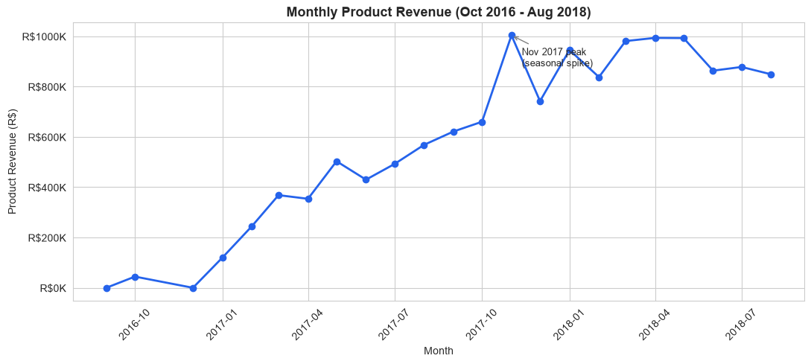
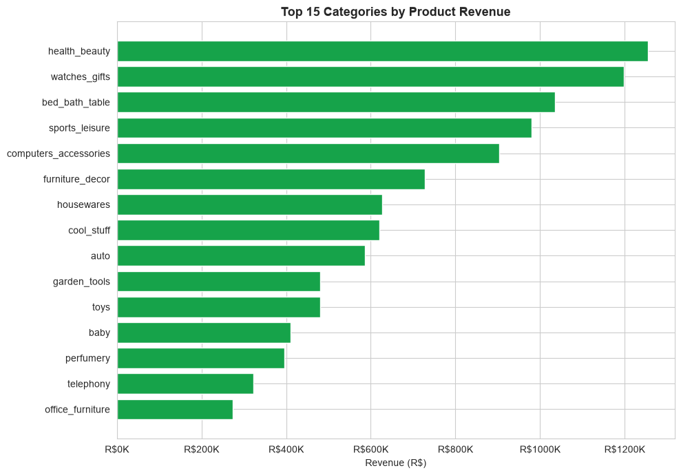
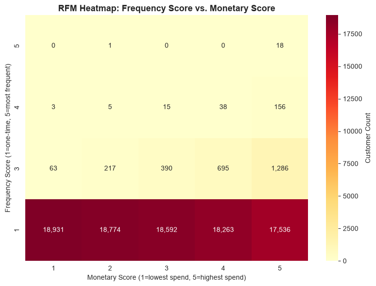
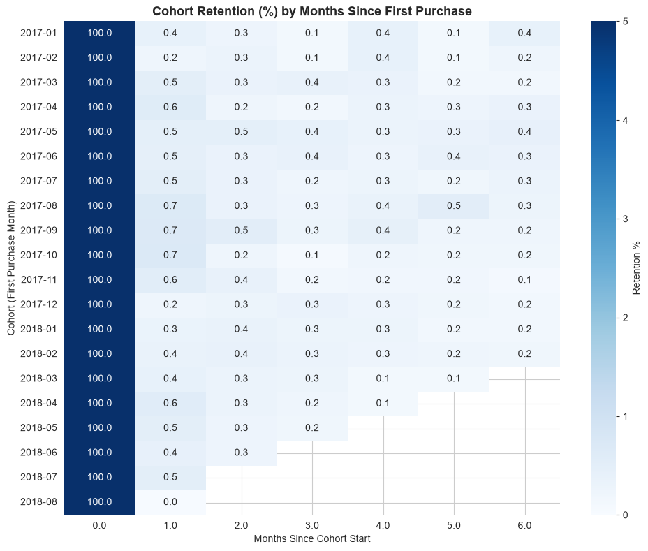
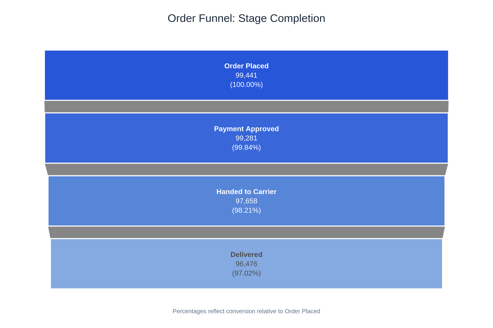
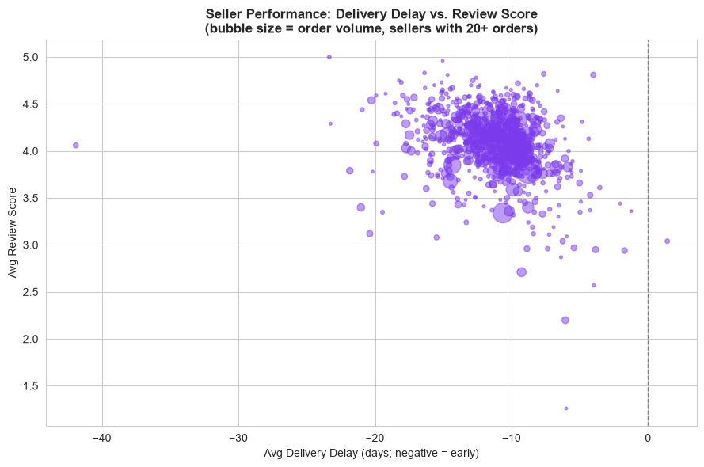
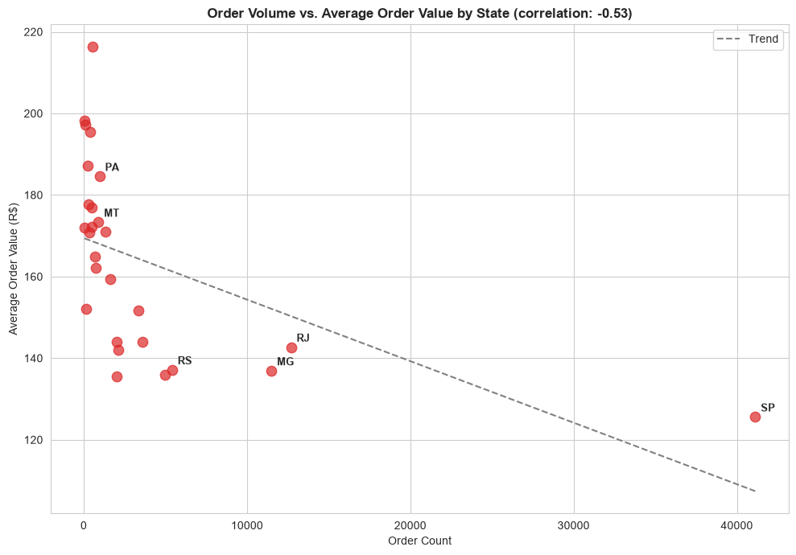
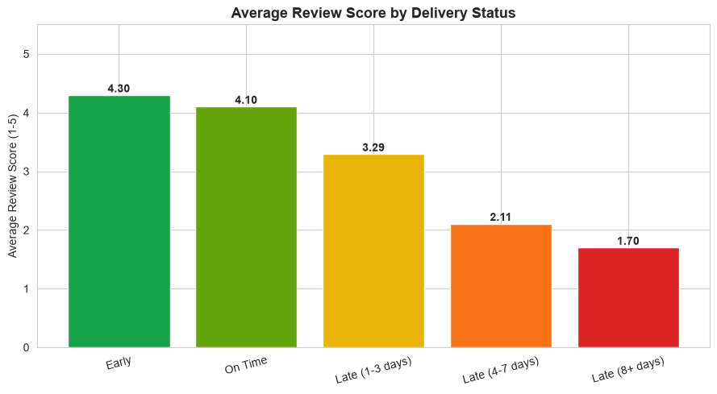

# Olist E-Commerce Revenue & Funnel Intelligence: A SQL-Driven Analytics Project

A portfolio-grade, SQL-first analytics project built on the Brazilian
E-Commerce Public Dataset by Olist — covering revenue, customer retention,
funnel performance, and operational efficiency, with a Python visualization
layer and a Power BI dashboard model on top.

## Project Overview

Olist is a Brazilian e-commerce marketplace connecting small/medium sellers
with customers. This project treats Olist's transactional data as a real
company database and builds a SQL-first analytics pipeline to answer
fundamental business questions: where revenue comes from, whether customers
return, where the order funnel leaks, and whether delivery operations are
strong enough to protect customer satisfaction.

**Headline finding:** only 3.04% of customers ever place a second order, and
retention falls under 1% within a single month for every cohort measured —
the central insight the rest of this project's recommendations are built
around. Full narrative: [`docs/business_insights.md`](docs/business_insights.md).

## Business Problem

Leadership lacked a unified analytics layer to answer: where is revenue
actually coming from, are customers returning, where does the order funnel
leak, and are sellers/delivery operations consistent enough to protect
customer satisfaction. This project builds that layer end-to-end — SQL
database, Python analysis, and a Power BI dashboard model.

## Dataset Overview

Brazilian E-Commerce Public Dataset by Olist ([Kaggle](https://www.kaggle.com/datasets/olistbr/brazilian-ecommerce)) —
9 relational tables covering ~99,441 orders, ~96,096 unique customers,
~3,095 sellers, and ~32,951 products across 2016-2018.
See [`data/README.md`](data/README.md) for download instructions and
[`docs/data_dictionary.md`](docs/data_dictionary.md) for table-level detail,
including documented data quality issues (the `customer_id` vs.
`customer_unique_id` distinction, `order_items` grain, geolocation
duplication, and others).

## Schema Overview

PostgreSQL schema: [`sql/schema/01_create_tables.sql`](sql/schema/01_create_tables.sql).
Power BI star schema (re-modeled for dashboarding):
[`docs/powerbi_model.md`](docs/powerbi_model.md).

## Analytical Approach

The project follows a defined framework ([`docs/analytics_framework.md`](docs/analytics_framework.md))
across five domains — Revenue, Funnel, Customer, Product, and Operational
analytics — with explicit, documented decisions on revenue definition
(`order_items.price`, excluding `canceled`/`unavailable` orders), customer
identity (`customer_unique_id`, never `customer_id`), and funnel definition
(a timestamp-based operational funnel, not a clickstream funnel, since this
dataset has no page-view/session events).

## SQL Concepts Demonstrated

CTEs (including multi-stage CTE chains), window functions (`LAG`, `RANK`,
`DENSE_RANK`, `NTILE`, running totals, rolling averages), `CASE WHEN`
segmentation logic, cohort analysis via self-referencing joins, conditional
aggregation, statistical correlation (`CORR()`), and grain-safe aggregation
patterns (pre-collapsing to order grain before customer-level rollups, to
prevent line-item fan-out). All 20 queries are individually documented with
business question, stakeholder relevance, and output interpretation —
see [`sql/`](sql/).

## Dashboard

Power BI dashboard model: 5 pages (Executive Overview, Revenue, Customer,
Operational, Funnel) — see [`docs/powerbi_build_guide.md`](docs/powerbi_build_guide.md)
for the full build walkthrough and [`docs/dax_measures.md`](docs/dax_measures.md)
for every DAX formula used. Data extracts ready for import:
[`powerbi/data_extracts/`](powerbi/data_extracts/).

### Visualizations

| | |
|---|---|
|  |  |
|  |  |
|  |  |
|  |  |

## Key Insights

1. **Revenue is broad-based** — the top category holds only 9.3% of revenue;
   it takes 9 categories to cross 50%.
2. **Retention is the platform's central weakness** — 3.04% repeat-purchase
   rate, with a retention cliff (not a gradual curve) by month 1.
3. **Customer value is concentrated by spend, not loyalty** — top 20% of
   customers drive 56.67% of revenue, mostly via large one-time purchases.
4. **Delivery delay is the strongest satisfaction driver** in the dataset —
   review scores fall from 4.29 to 1.69 as delay passes 8 days.
5. **The platform delivers early almost everywhere** (90.37% of orders),
   suggesting overly conservative delivery estimates.
6. **Geography reveals a reach problem, not a demand problem** — order
   volume and AOV are negatively correlated across all 27 states (r = -0.53).

Full findings with source-query references: [`docs/business_insights.md`](docs/business_insights.md).
Quick-reference summary: [`docs/executive_summary.md`](docs/executive_summary.md).

## Recommendations

1. Target high-spend one-time buyers with second-purchase incentives, rather
   than building loyalty programs around an already-tiny repeat base.
2. Prioritize eliminating long-tail (8+ day) delivery delays over average
   delivery speed.
3. Audit and tighten delivery-estimate accuracy given the platform-wide
   early-delivery pattern.
4. Invest in logistics/regional presence in high-AOV, low-volume states
   instead of regional discounting.
5. Explore installment-financing options for high-ticket, low-volume
   categories like `computers`.

## Tech Stack

- **PostgreSQL 16** — database, all 20 analytical queries
- **Python** (pandas, numpy, matplotlib, seaborn, sqlalchemy, psycopg2) —
  EDA and visualization, built on top of validated SQL output
- **Power BI** — star-schema dashboard model, DAX measures
- **Git / GitHub** — version control and portfolio presentation

## Project Structure

```
.
├── data/                     # Raw CSVs (gitignored) + download instructions
├── sql/
│   ├── schema/               # Table creation, data load, validation, indexes
│   ├── revenue_analysis/     # Queries 1-7, 16-17
│   ├── customer_analysis/    # Queries 8-11 (RFM, retention, cohort, CLV)
│   ├── funnel_analysis/      # Queries 12, 18
│   ├── operational_analysis/ # Queries 13-15
│   └── advanced_queries/     # Queries 19-20 (concentration, surprising insight)
├── notebooks/
│   ├── eda.ipynb                    # DB connection, data quality validation, data pulls
│   └── visualization_analysis.ipynb # All 8 insight-focused charts
├── powerbi/
│   └── data_extracts/        # CSVs + extraction SQL for the Power BI model
├── images/                   # Chart exports used in this README
├── docs/
│   ├── data_dictionary.md
│   ├── analytics_framework.md
│   ├── powerbi_model.md
│   ├── powerbi_build_guide.md
│   ├── powerbi_data_modeling_concepts.md
│   ├── dax_measures.md
│   ├── business_insights.md
│   └── executive_summary.md
├── scripts/
│   └── 00_setup_database.sh
├── README.md
├── requirements.txt
└── .gitignore
```

## How to Reproduce This Project

1. Install PostgreSQL and Python 3.x
2. Download the Olist dataset into `data/` (see [`data/README.md`](data/README.md))
3. Run `bash scripts/00_setup_database.sh` (or follow its manual steps)
4. Install Python dependencies: `pip install -r requirements.txt`
5. Run `notebooks/eda.ipynb` first (caches data for the visualization notebook),
   then `notebooks/visualization_analysis.ipynb`
6. Import `powerbi/data_extracts/*.csv` into Power BI Desktop following
   [`docs/powerbi_build_guide.md`](docs/powerbi_build_guide.md)

## Future Improvements

- Predictive CLV modeling (this project measures historical CLV only)
- Seller-level root-cause analysis for the late-delivery tail
- A/B testing on delivery-estimate tightening before platform-wide rollout
- Marketing-channel data integration to evaluate retention ROI against
  actual acquisition cost
